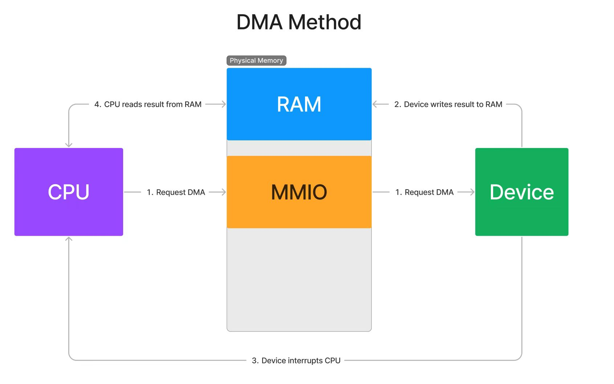
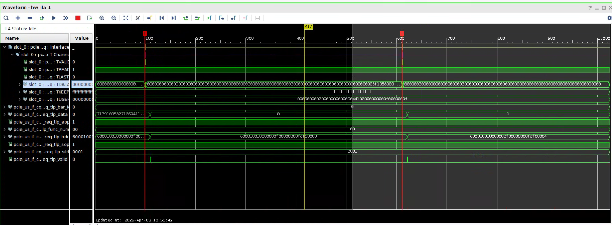
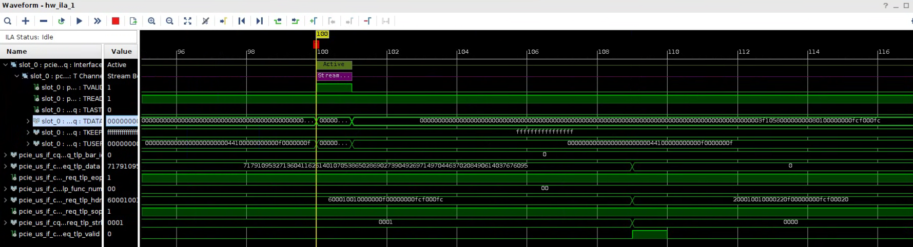

# :rocket: FPGA PCIe4 Protocol Implementation


| version                                    | function                                                     |
| ------------------------------------------ | ------------------------------------------------------------ |
| <span style="color:green">2026-6-12</span> | <span style="color:red">完成基本的BAR空间传输，支持2个bar id，完成C2H和H2C的双向操作，linux驱动支持，<br>同时完善了相应的api函数，测试空间4MB，DMA模式为Block DMA，用户接口为AXI4-Stream</span> |
| <span style="color:green">2026-6-17</span> | <span style="color:red">增加AXIS转AXI-FULL的功能</span>      |


## :pencil2: System architecture

<span style="color:pink">使用xilinx的pcie硬核进行pcie通信。分4个接口，cq，cc，rq，rc。其中cq是来自host访问fpga的bar空间，pcie基于bar来通信，bar空间的寄存器用于存储host的物理地址以及dma的长度。bar空间的具体信息如下：</span>

<span style="color:pink">目前对接ip的axis接口来自alex的verilog-pcie，用于将标准的传输层协议包转换成AMD的协议接口。</span>

| <span style="color:red">reg addr</span> | description                                                  | <span style="color:red">reg addr</span> | description                                                  |
| --------------------------------------- | ------------------------------------------------------------ | --------------------------------------- | ------------------------------------------------------------ |
| <span style = "color:green">0x0</span>  | <span style="color:yellow">c2h操作的物理地址低32bit       C2H_BlockDMA_Address[31:0]</span> | <span style="color:green">0xe</span>    | <span style="color:yellow">c2h操作的物理地址低32bit       C2H_Scatter_gather_DMA_Address[31:0]</span> |
| <span style = "color:green">0x1</span>  | <span style = "color:yellow">c2h操作的物理地址高32bit       C2H_BlockDMA_Address[63:32]</span> | <span style="color:green">0xf</span>    | <span style="color:yellow">c2h操作的物理地址高32bit       C2H_Scatter_gather_DMA_Address[63:32]</span> |
| <span style = "color:green">0x2</span>  | <span style = "color:yellow">c2h开始信号，开始DMA传输</span> | <span style="color:green">0x10</span>   | <span style="color:yellow">Scatter Gather DMA c2h开始信号，开始DMA传输</span> |
| <span style = "color:green">0x3</span>  | <span style = "color:yellow">c2h一次DMA的长度，最大不超过4MB</span> | <span style="color:green">0x11</span>   | <span style="color:yellow">Scatter Gather C2H DMA 的长度</span> |
| <span style = "color:green">0x4</span>  | <span style = "color:yellow">h2c操作的物理地址低32bit       H2C_BlockDMA_Address[31:0]</span> | <span style="color:green">0x12</span>   | <span style="color:yellow">h2c操作的物理地址低32bit H2C_Scatter_gather_DMA_Address[31:0]</span> |
| <span style = "color:green">0x5</span>  | <span style = "color:yellow">h2c操作的物理地址高32bit       H2C_BlockDMA_Address[63:32]</span> | <span style="color:green">0x13</span>   | <span style="color:yellow">h2c操作的物理地址高32bit H2C_Scatter_gather_DMA_Address[63:32]</span> |
| <span style = "color:green">0x6</span>  | <span style = "color:yellow">h2c开始信号，开始DMA传输</span> | <span style="color:green">0x14</span>   | <span style="color:yellow">Scatter Gather DMA h2c开始信号，开始DMA传输</span> |
| <span style = "color:green">0x7</span>  | <span style = "color:yellow">h2c一次DMA的长度，最大不超过4MB</span> | <span style="color:green">0x15</span>   | <span style="color:yellow">Scatter Gather h2c DMA 的长度</span> |
| <span style = "color:green">0x8</span>  | <span style = "color:yellow">c2h Block DMA的状态</span>      | <span style="color:green">0x16</span>   | <span style = "color:yellow">Scatter Gather  c2h Block DMA的状态</span> |
| <span style = "color:green">0x9</span>  | <span style = "color:yellow">h2c Block DMA的状态</span>      | <span style="color:green">0x17</span>   | <span style = "color:yellow">Scatter Gather  h2c Block DMA的状态</span> |
| <span style="color:green">0xa</span>    | <span style="color:yellow">c2h操作fpga中DDR的64bit地址的高32bit</span> | <span style="color:green">0x18</span>   | <span style = "color:yellow">Scatter Gather C2H 链表的表项数</span> |
| <span style="color:green">0xb</span>    | <span style="color:yellow">c2h操作fpga中DDR的64bit地址的低32bit</span> | <span style="color:green">0x19</span>   | <span style = "color:yellow">Scatter Gather H2C 链表的表项数</span> |
| <span style="color:green">0xc</span>    | <span style="color:yellow">h2c操作fpga中DDR的64bit地址的高32bit</span> | <span style="color:green">0x1a</span>   | <span style="color:yellow">Scatter Gather C2H 操作fpga中DDR的64bit的高32bit</span> |
| <span style="color:green">0xd</span>    | <span style="color:yellow">h2c操作fpga中DDR的64bit地址的低32bit</span> | <span style="color:green">0x1b</span>   | <span style="color:yellow">Scatter Gather C2H 操作fpga中DDR的64bit的低32bit</span> |
| <span style="color:green">0x1c</span>   | <span style="color:yellow">Scatter Gather H2C 操作fpga中DDR的64bit的高32bit</span> | <span style="color:green">0x1d</span>   | <span style="color:yellow">Scatter Gather H2C 操作fpga中DDR的64bit的低32bit</span> |

系统结构如下：



整个DMA通过Bar空间进行通信。在linux终端进行操作，通过函数**<span style="color:yellow">fpga_bl_c2h</span>**来启动，函数通过调用驱动中的<span style="color:pink">block_h2c</span>函数来执行DMA操作。

### :pencil: C2H Operate

C2H执行流程如下：通过<span style="color:pink">write_reg</span>将此次DMA的长度，内存所在的物理地址，fpga的硬件内存地址以及开始传输的start信号写入到寄存器中。当启动后，进入等待队列，如果fpga完成了写内存操作，接下来会触发msi中断，结束等待，通过<span style="color:pink">copy_to_user</span>函数将内存中的数据搬运到用户空间。

```c
int block_c2h(struct fpga_pdev *fpdev, unsigned int *c2h_buffer, 
    unsigned int c2h_bufsize, unsigned long long timeout, unsigned long long fpga_sdram_addr)
{
	dma_addr_t dma_addr = 0;
	unsigned int c2h_dma_status;
	long timeouto;
	int ret;
	struct device *dev = &fpdev->dev->dev;

	//write fpga sdram low 32bit address
	write_reg(fpdev, C2H_BLOCK_SDRAM_ADDR_LO, fpga_sdram_addr & 0xffffffff, 0);
	//write fpga sdram high 32bit address
	write_reg(fpdev, C2H_BLOCK_SDRAM_ADDR_HO, (fpga_sdram_addr >> 32) & 0xffffffff,0);
	//write length
	write_reg(fpdev, C2H_BLOCK_DMA_LENGTH, c2h_bufsize & 0xffffffff , 0);

	#ifdef STREAM_DMA
	#if LINUX_VERSION_CODE < KERNEL_VERSION(5,0,0)
		dma_addr = pci_map_single(fpdev->dev, fpdev->c2h_bl_dma_vaddr, 
								BLOCK_DMA_BUF_SIZE, PCI_DMA_FROMDEVICE);
	#else
		dma_addr = dma_map_single(&fpdev->dev->dev, fpdev->c2h_bl_dma_vaddr, 
								BLOCK_DMA_BUF_SIZE, DMA_FROM_DEVICE);
	#endif            
	#else
	dma_addr = fpdev->c2h_bl_dma_hwaddr;
	#endif	

	write_reg(fpdev, C2H_BLOCK_DMA_ADDR_LO, dma_addr & 0xffffffff , 0);
	write_reg(fpdev, C2H_BLOCK_DMA_ADDR_HO, (dma_addr >> 32) & 0xffffffff , 0);      
	//start dma
	write_reg(fpdev, C2H_BLOCK_DMA_START, 1 , 0);
	
	timeouto = msecs_to_jiffies(timeout);

	while (1){
		ret = wait_event_interruptible_timeout(fpdev->c2h_bl_waitq, (atomic_read(&fpdev->intr_c2h_status) != 0), timeouto);

		if(ret == -ERESTARTSYS){
			atomic_set(&fpdev->intr_c2h_status, 0);
			dev_info(dev, "fpdev: C2H interrupted by signal\n");
			#ifdef STREAM_DMA
			dma_unmap_single(&fpdev->dev->dev, dma_addr, BLOCK_DMA_BUF_SIZE, DMA_FROM_DEVICE);
			#endif
			return -ERESTARTSYS;
		}

		if(ret == 0){
			atomic_set(&fpdev->intr_c2h_status, 0);
			dev_info(dev, "fpdev: C2H timed out\n");
			#ifdef STREAM_DMA
			dma_unmap_single(&fpdev->dev->dev, dma_addr, BLOCK_DMA_BUF_SIZE, DMA_FROM_DEVICE);
			#endif
			return -ETIMEDOUT;
		}

		if(atomic_read(&fpdev->intr_c2h_status) != 0){
			c2h_dma_status = read_reg(fpdev, C2H_BLOCK_DMA_STATUS, 0);
			if(c2h_dma_status & 0x1){
				write_reg(fpdev, C2H_BLOCK_DMA_STATUS, 0, 0);
				#ifdef STREAM_DMA
				#if LINUX_VERSION_CODE < KERNEL_VERSION(5,0,0)
					dma_unmap_single(fpdev->dev, dma_addr, BLOCK_DMA_BUF_SIZE, PCI_DMA_FROMDEVICE);
				#else
					dma_unmap_single(&fpdev->dev->dev, dma_addr, BLOCK_DMA_BUF_SIZE, DMA_FROM_DEVICE);
				#endif
				#endif
				atomic_set(&fpdev->intr_c2h_status, 0);
				dev_info(dev, "fpdev: C2H completed\n");
				
				if(c2h_bufsize > BLOCK_DMA_BUF_SIZE){
					if(copy_to_user(c2h_buffer, (unsigned int *)fpdev->c2h_bl_dma_vaddr, c2h_bufsize)){
						dev_err(dev, "fpdev: dma copy_to_user error!\n");
					}
					return -EINVAL;
				}
				else {
					if(copy_to_user(c2h_buffer, (unsigned int *)fpdev->c2h_bl_dma_vaddr, c2h_bufsize)){
						dev_err(dev, "fpdev: dma copy_to_user error!\n");
					}
					return c2h_bufsize;
				}
			}
		}
	}
}
```


### :pencil: H2C Operate

H2C操作流程如下：

H2C操作分为两部分，第一部分是FPGA向RC侧发送mrd包，每个mrd包的tag编号来自于tag  fifo。当fifo满时，不再分配tag编号。

第二部分是解析cpld包，每个cpld包在返回时都会携带tag编号，当cpld包返回的数据长度满足申请的长度时，此时tag fifo可以释放一个tag。

再驱动端，需要先申请4MB的空间用于将用户空间的数据存入在内核空间中，这些数据在物理内存，RC侧通过接收mrd包返回cpld包。

```c
int block_h2c(struct fpga_pdev *fpdev, unsigned int *h2c_buffer, 
    unsigned int h2c_bufsize, unsigned long long timeout, unsigned long long fpga_sdram_addr){
	long timeouto;
	int ret;
	unsigned int h2c_dma_status;
	struct device *dev = &fpdev->dev->dev;
  dma_addr_t dma_addr;

	dev_info(dev, "Start H2C DMA\n");
	if(h2c_bufsize != 0){
		dev_info(dev, "fpdev: Move the data in user space to the kernel space\n");
		if(copy_from_user((unsigned int *)fpdev->h2c_bl_dma_vaddr, h2c_buffer, h2c_bufsize)){
			dev_err(dev, "fpdev: dma copy_to_user error! \n");
			return -EFAULT;
		}
	}
	else {
		dev_err(dev, "fpdev: h2c_bufsize must not be 0 \n");
		return -EINVAL;
	}
	#ifdef STREAM_DMA
	#if LINUX_VERSION_CODE < KERNEL_VERSION(5,0,0)
		dma_addr = pci_map_single(fpdev->dev, fpdev->h2c_bl_dma_vaddr, BLOCK_DMA_BUF_SIZE, PCI_DMA_TODEVICE);
	#else
		dma_addr = dma_map_single(&fpdev->dev->dev, fpdev->h2c_bl_dma_vaddr, BLOCK_DMA_BUF_SIZE, DMA_TO_DEVICE);

		if (dma_mapping_error(&fpdev->dev->dev, dma_addr)) {
			dev_err(dev, "fpdev: DMA mapping failed\n");
			return -EFAULT;
		}
	#endif
	#else
	dma_addr = fpdev->h2c_bl_dma_hwaddr;
	#endif	

	//host write register to fpga's bar dma address low address 
	write_reg(fpdev, H2C_BLOCK_DMA_ADDR_LO, dma_addr & 0xffffffff, 0);
	//host write register to fpga's bar dma address high address 
	write_reg(fpdev, H2C_BLOCK_DMA_ADDR_HO, (dma_addr >> 32) & 0xffffffff, 0);
	//host write register to fpga's bar ddr address low address 
	write_reg(fpdev, H2C_BLOCK_SDRAM_ADDR_LO, fpga_sdram_addr & 0xffffffff, 0);
	//host write register to fpga's bar ddr address high address 
	write_reg(fpdev, H2C_BLOCK_SDRAM_ADDR_HO, (fpga_sdram_addr >> 32) & 0xffffffff, 0); 
	//write length to bar
	write_reg(fpdev, H2C_BLOCK_DMA_LENGTH, h2c_bufsize & 0xffffffff, 0);   
	//start
	write_reg(fpdev, H2C_BLOCK_DMA_START, 0x1, 0);  

	timeouto = msecs_to_jiffies(timeout);
	while(1){
		ret = wait_event_interruptible_timeout(fpdev->h2c_bl_waitq, (atomic_read(&fpdev->intr_h2c_status) != 0), timeouto);
		if(ret == -ERESTARTSYS){
			atomic_set(&fpdev->intr_h2c_status, 0);
			dev_info(dev, "fpdev: H2C interrupted by signal\n");
			#ifdef STREAM_DMA
			dma_unmap_single(&fpdev->dev->dev, dma_addr, BLOCK_DMA_BUF_SIZE, DMA_TO_DEVICE);
			#endif
			return -ERESTARTSYS;
		}

		if(ret == 0){
			atomic_set(&fpdev->intr_h2c_status, 0);
			dev_info(dev, "fpdev: H2C timed out\n");
			#ifdef STREAM_DMA
			dma_unmap_single(&fpdev->dev->dev, dma_addr, BLOCK_DMA_BUF_SIZE, DMA_TO_DEVICE);
			#endif
			return -ETIMEDOUT;
		}

		if(atomic_read(&fpdev->intr_h2c_status) != 0){
			dev_info(dev, "fpdev: H2C DMA has done \n");
			h2c_dma_status = read_reg(fpdev, H2C_BLOCK_DMA_STATUS, 0);
			if(h2c_dma_status == 0x01){
				write_reg(fpdev, H2C_BLOCK_DMA_STATUS, 0 , 0);
				#ifdef STREAM_DMA
				#if LINUX_VERSION_CODE < KERNEL_VERSION(5,0,0)
					pci_unmap_single(fpdev->dev, dma_addr, BLOCK_DMA_BUF_SIZE, PCI_DMA_TODEVICE);
				#else
					dma_unmap_single(&fpdev->dev->dev, dma_addr, BLOCK_DMA_BUF_SIZE, DMA_TO_DEVICE);
				#endif
				#endif
				atomic_set(&fpdev->intr_h2c_status,0);
				#ifdef DEBUG
				dev_info(dev, "fpdev: clean h2c intr_h2c_status dma done \n");
				#endif
				return h2c_bufsize;
			}
		}
	}
}
```


## :pencil2: Build Flow

使用git clone命令下载项目。

```cmd
zhi:$ git clone git@github.com:Salefine/fpga_pcie_usplus.git
```

linux下操作目录

进入到example目录下：

```cmd
zhi:$ cd example/xcvu5p/fpga
```

修改Makefile文件里面的vivado目录。

```makefile
SHELL := /bin/bash

VIVADO_HOME := /tools/xilinx22_2/Vivado/2022.2
VIVADO_BIN  := $(VIVADO_HOME)/bin/vivado
```

完成之后make即可

```cmd
zhi:~/fpga_pcie_usplus/example/xcvu5p/fpga$ make
```

windows下操作：

进入到fpga_pcie_usplus\scripts>目录，修改build.bat文件中的vivado安装目录，完成之后双击该文件即可创建工程。

```bat
set VIVADO_DIR=D:/tools/xilinx2024.2/Vivado/2024.2/bin
set PRJ_DIR=F:/AMD_Ultrascale_Flow/fpga_pcie_usplus/example/xcvu5p/fpga
set PRJ_NAME=fpga
set PART=xcvu5p-flvb2104-2-i
```


## :pencil2: Bar空间寄存器读写

当下载完fpga的bit文件后，重启主机，此时驱动会打印如下信息：

```cmd
[    7.328731] fpgaDMA: loading out-of-tree module taints kernel.
[    7.328841] fpgaDMA: module verification failed: signature and/or required key missing - tainting kernel
[    7.329598] fpga_dma: start fpga_init 
[    7.329659] fpga_dma: start fpga_probe
[    7.329675] fpgaDMA 0000:01:00.0: enabling device (0000 -> 0002)
[    7.329692] fpga_dma: found FPGA with name: fpgaDMA0
[    7.329696] fpga_dma: vendor id: 0x10EE
[    7.329699] fpga_dma: device id: 0x903F
[    7.329709] fpgaDMA 0000:01:00.0: fpga_dma: BAR[0] 0xfcf10000-0xfcf107ff flags 0x00040200
[    7.329717] fpgaDMA 0000:01:00.0: fpga_dma: BAR[1] 0xfcf00000-0xfcf0ffff flags 0x00040200
[    7.329762] fpga_dma: BAR[0] mapped at 0x0000000027846854, with length 2048
[    7.329785] fpga_dma: BAR[1] mapped at 0x00000000533cac62, with length 65536
[    7.329903] fpga_dma: allocate 1 irq start0
[    7.331481] fpga_dma: allocate dma buffer 4194304 bytes
[    7.331489] fpga_dma: success to register irq vector is 1
[    7.331499] fpga_dma: success to register char device fpgaDMA
[    7.331722] fpga_dma: saved FPGA with id: 0
[    7.331725] fpga_dma: end fpga_probe
[    7.331799] fpga_dma: end fpga_init
```

通过驱动打印可以知道开启了两个bar空间。都是32bit位宽，同时打印了bar空间的大小。


### :pencil: MWR TLP 详细解析

测试cq接口，使能straddle功能，接口功能如下：

通过<span style="color:pink">reg_rw</span>函数来执行寄存器写操作：

```cmd
zhi:~/fpga_pcie_usplus/fpga_driver/linux/tools$ ./reg_rw w 0 24 0x12345678
write bar's reg addr = 0x18 ! data is 0x12345678
```




### :pencil2: 原始数据（按DW划分）

```shell
axis_value$ 000000000000000000000000000000000000000000000000000000000000000000000000000000000000000000000000105800000000080100000000fcf00000
```

```shell
DW0: 0x60001001
DW1: 0x0000000f
DW2: 0x00000000
DW3: 0xfcf00000
```

------

### 📊 逐字段解析（标准TLP格式）

### 🧾 DW0（TLP类型 + 长度等）

| 字段   | 位段    | 值     | 解析                            |
| ------ | ------- | ------ | ------------------------------- |
| FMT    | [31:29] | 011b   | **4DW Header + Data**           |
| TYPE   | [28:24] | 00000b | **Memory Write Request (MWr)**  |
| TC     | [22:20] | 000    | Traffic Class = 0               |
| Attr   | [13:12] | 00     | No Snoop / Relaxed Ordering = 0 |
| TH     | [16]    | 0      | TLP Processing Hint = 0         |
| TD     | [15]    | 0      | No Digest                       |
| EP     | [14]    | 0      | No Poison                       |
| AT     | [11:10] | 00     | Address Type = Untranslated     |
| Length | [9:0]   | 0x001  | **1 DW（4字节数据）**           |

------

### 🧾 DW1（Requester信息）

| 字段         | 位段    | 值     | 解析                                          |
| ------------ | ------- | ------ | --------------------------------------------- |
| Requester ID | [31:16] | 0x0000 | Bus=0, Device=0, Function=0                   |
| Tag          | [15:8]  | 0x00   | Tag = 0                                       |
| Last BE      | [7:4]   | 0x0    | Last Byte Enable                              |
| First BE     | [3:0]   | 0xF    | **First DW Byte Enable = 1111（全字节有效）** |

------

### 🧾 DW2 + DW3（地址字段）

👉 因为是 **4DW Header** → 地址是 64bit

| 字段           | 值         | 解析   |
| -------------- | ---------- | ------ |
| Address[63:32] | 0x00000000 | 高32位 |
| Address[31:0]  | 0xfcf00000 | 低32位 |

👉 **最终地址：**

```
0x00000000fcf00000
```


### :pencil: MRD TLP 详细解析

通过<span style="color:pink">reg_rw</span>函数来执行寄存器读操作：

```cmd
zhi:~/fpga_pcie_usplus/fpga_driver/linux/tools$ ./reg_rw r 0 24 
read bar's reg addr = 0x18 ! data is 0x12345678
```



### 🔢 按DW划分

```cmd
axis_value$ 000000000000000000000000000000000000000000000000000000000000000000000000000000000000000000000000105800220000000100000000fcf00020
```

```cmd
cmd:$
DW0: 0x20001001
DW1: 0x0000220f
DW2: 0x00000000
DW3: 0xfcf00020
```

回复包如下(回复100)：

```cmd
cmd:$
DW0: 0x4A000001
DW1: 0x00000004
DW2: 0x00002220
DW3: 0x00000064
```


------

### 📊 字段解析

### 🧾 DW0（类型字段）

| 字段   | 位段    | 值     | 解析                     |
| ------ | ------- | ------ | ------------------------ |
| FMT    | [31:29] | 001b   | **4DW Header（无数据）** |
| TYPE   | [28:24] | 00000b | **Memory Read (MRd)**    |
| TC     | [22:20] | 000    | TC = 0                   |
| Attr   | [13:12] | 00     | 默认                     |
| Length | [9:0]   | 0x001  | **读 1 DW（4字节）**     |

------

### 🧾 DW1（Requester 信息）

| 字段         | 位段    | 值     | 解析                     |
| ------------ | ------- | ------ | ------------------------ |
| Requester ID | [31:16] | 0x0000 | Bus=0 Dev=0 Func=0       |
| Tag          | [15:8]  | 0x22   | ⭐ **Tag = 0x22（关键）** |
| Last BE      | [7:4]   | 0x0    | Last DW                  |
| First BE     | [3:0]   | 0xF    | 全字节有效               |

------

### 🧾 地址字段

| 字段           | 值         |
| -------------- | ---------- |
| Address[63:32] | 0x00000000 |
| Address[31:0]  | 0xfcf00020 |

👉 最终地址：

```
0x00000000fcf00020
```

### 2.1 DW0（Header, Completion类型）

| 字段         | 位段    | 值     | 说明                                    |
| ------------ | ------- | ------ | --------------------------------------- |
| FMT          | [31:29] | 010b   | 3DW Header + Data（Completion w/ Data） |
| Type         | [28:24] | 01010b | Memory Read Completion w/ Data          |
| TC           | [22:20] | 000    | Traffic Class = 0                       |
| R            | [19]    | 0      | Reserved                                |
| Completer ID | [18:8]  | 0x0000 | FPGA bus/device/function ID             |
| Status       | [7:5]   | 000    | Successful Completion                   |
| BCM          | [4]     | 0      | Byte Count Modified                     |
| Byte Count   | [11:0]  | 0x004  | 数据长度 = 4 bytes                      |

> 注意：Byte Count = 4，因为 MRd 只请求 1 DW（4 字节）

------

### 2.2 DW1（Requester ID + Tag）

| 字段         | 位段    | 值     | 说明              |
| ------------ | ------- | ------ | ----------------- |
| Requester ID | [31:16] | 0x0000 | 从 MRd 请求中复制 |
| Tag          | [15:8]  | 0x22   | 从 MRd 请求中复制 |
| Last BE      | [7:4]   | 0x0    | Last Byte Enable  |
| First BE     | [3:0]   | 0xF    | 全字节有效        |

------

### 2.3 DW2（Address / Lower Bits for 64bit）

| 字段               | 值       | 说明                            |
| ------------------ | -------- | ------------------------------- |
| Lower Address[7:0] | 0x20     | MRd 请求地址低 8 位（fcf00020） |
| 其余位             | 0x000000 | Reserved / R                    |

------

### 2.4 DW3（Data）

```
0x00000064
```


### CPLD包解析

```cmd
0x4a000020000902000100000000000000
```

| DW   | 原始数据     | 字段              | 位域    | 解析值      | 含义                                 |
| ---- | ------------ | ----------------- | ------- | ----------- | ------------------------------------ |
| DW0  | `0x4A000020` | FMT               | [31:29] | `010b`      | 3DW Header with Data                 |
|      |              | TYPE              | [28:24] | `01010b`    | Completion                           |
|      |              | TC                | [22:20] | `000b`      | Traffic Class = 0                    |
|      |              | Attr              | [13:12] | `00b`       | No Snoop / Relaxed Ordering disabled |
|      |              | TH                | [16]    | `0`         | TH disabled                          |
|      |              | TD                | [15]    | `0`         | No TLP Digest                        |
|      |              | EP                | [14]    | `0`         | Poisoned = No                        |
|      |              | AT                | [11:10] | `00b`       | Untranslated                         |
|      |              | Length            | [9:0]   | `0x020`     | 32 DW                                |
|      |              | Payload Bytes     | —       | `128 Bytes` | `32 × 4`                             |
| DW1  | `0x00090200` | Completer ID      | [31:16] | `0x0009`    | Completion 发起端 BDF                |
|      |              | Completion Status | [15:13] | `000b`      | Successful Completion (SC)           |
|      |              | BCM               | [12]    | `0`         | BCM disabled                         |
|      |              | Byte Count        | [11:0]  | `0x200`     | 512 Bytes remaining                  |
| DW2  | `0x01000000` | Requester ID      | [31:16] | `0x0100`    | 原请求发起者                         |
|      |              | Tag               | [15:8]  | `0x00`      | 对应 MRd Tag=0                       |
|      |              | Lower Address     | [6:0]   | `0x00`      | Payload 从 DWORD 边界开始            |
| DW3  | `0x00000000` | Payload Data      | —       | —           | 这里只是你抓包中的后续数据开始       |


### :pencil: C2H DMA

通过<span style="color:pink">dma_from_device</span>来执行C2H操作将FPGA中的数据写入到主机物理内存中。测试4MB写入性能。

```cmd
ees@ees-zhi:~/fpga_pcie_usplus/fpga_driver/linux/tools$ ./dma_from_device -f datafile.bin -a 0x0 -s 0x400000
DMA success: 4194304 bytes written to datafile.bin
DMA transfer size : 4194304 bytes
DMA time          : 0.009871 sec
DMA bandwidth     : 405.23 MB/s
```

整个C2H操作驱动层面打印信息如下：

```cmd
ees@ees-zhi:~/fpga_pcie_usplus/fpga_driver/linux/tools$ sudo dmesg
[1212.073643] fpga_dma: start fpga_ioctl 
[ 1212.073648] fpga_dma: write_reg,sc->bar[0]:0000000028ed89b1,offset:10 , val:0x0 
[ 1212.073655] fpga_dma: write_reg,sc->bar[0]:0000000028ed89b1,offset:11 , val:0x0 
[ 1212.073659] fpga_dma: write_reg,sc->bar[0]:0000000028ed89b1,offset:3 , val:0x2fff 
[ 1212.073663] fpga_dma: write_reg,sc->bar[0]:0000000028ed89b1,offset:0 , val:0xcfc00000 
[ 1212.073666] fpga_dma: write_reg,sc->bar[0]:0000000028ed89b1,offset:1 , val:0x0 
[ 1212.073669] fpga_dma: write_reg,sc->bar[0]:0000000028ed89b1,offset:2 , val:0x1 
[ 1212.073692] fpga_dma: read_reg,sc->bar[0]:0000000028ed89b1,offset:8 
[ 1212.073704] fpga_dma: read_reg,sc->bar[0]:0000000028ed89b1,offset:9 
[ 1212.073710] fpga_dma: intr intr_status 1 .
[ 1212.073713] fpga_dma: intr intr_status 0 .
[ 1212.073718] fpga_dma: wake up c2h_bl_waitq 0.
[ 1212.073721] fpga_dma: hold interrupt 0.
[ 1212.073744] fpga_dma: read_reg,sc->bar[0]:0000000028ed89b1,offset:8 
[ 1212.073752] fpga_dma: write_reg,sc->bar[0]:0000000028ed89b1,offset:8 , val:0x0 
[ 1212.073756] fpga_dma: clean c2h intr_c2h_status dma done 
```

 

### :pencil: H2C DMA

执行H2C流程，读取主机的0x1000个字节的数据，其中每个header都携带两组data，每组data包含64个字节。返回的tlp包的包头如下：

H2C模块执行结果如下：

```cmd
ees@ees-zhi:~/fpga_pcie_usplus/fpga_driver/linux/tools$ ./dma_to_device -f data.bin -a 0x0 -s 0xffff

H2C DMA SUCCESS
File             : data.bin
FPGA Address     : 0x0000000000000000
Transfer Size    : 65535 bytes
DMA Time         : 0.000272 sec
DMA Bandwidth    : 229.58 MB/s

ees@ees-zhi:~/fpga_pcie_usplus/fpga_driver/linux/tools$ sudo dmesg | grep fpga
[  600.162625] fpga_dma: start fpga_ioctl 
[  600.162639] fpga_dma: write_reg,sc->bar[0]:000000002c602e01,offset:4 , val:0xcf800000 
[  600.162646] fpga_dma: write_reg,sc->bar[0]:000000002c602e01,offset:5 , val:0x0 
[  600.162650] fpga_dma: write_reg,sc->bar[0]:000000002c602e01,offset:12 , val:0x0 
[  600.162654] fpga_dma: write_reg,sc->bar[0]:000000002c602e01,offset:13 , val:0x0 
[  600.162657] fpga_dma: write_reg,sc->bar[0]:000000002c602e01,offset:7 , val:0xffff 
[  600.162661] fpga_dma: write_reg,sc->bar[0]:000000002c602e01,offset:6 , val:0x1 
[  600.162704] fpga_dma: read_reg,sc->bar[0]:000000002c602e01,offset:8 
[  600.162714] fpga_dma: read_reg,sc->bar[0]:000000002c602e01,offset:9 
[  600.162719] fpga_dma: intr intr_status 0 .
[  600.162721] fpga_dma: intr intr_status 1 .
[  600.162728] fpga_dma: wake up h2c_bl_waitq 0.
[  600.162730] fpga_dma: hold interrupt 0.
[  600.162756] fpga_dma: H2C req dma end 
[  600.162760] fpga_dma: read_reg,sc->bar[0]:000000002c602e01,offset:9 

ees@ees-zhi:~/fpga_pcie_usplus/fpga_driver/linux/tools$ ./dma_to_device -f datafile4MB.bin -a 0x0 -s 0x10000

H2C DMA SUCCESS
File             : datafile4MB.bin
FPGA Address     : 0x0000000000000000
Transfer Size    : 65536 bytes
DMA Time         : 0.016568 sec
DMA Bandwidth    : 3.77 MB/s
ees@ees-zhi:~/fpga_pcie_usplus/fpga_driver/linux/tools$ ./dma_from_device -f datafile.bin -a 0x0 -s 0x10000
DMA success: 65536 bytes written to datafile.bin
DMA transfer size : 65536 bytes
DMA time          : 0.000122 sec
DMA bandwidth     : 514.01 MB/s 
ees@ees-zhi:~/fpga_pcie_usplus/fpga_driver/linux/tools$ cmp datafile.bin datafile4MB.bin 
cmp: EOF on datafile.bin after byte 65536, in line 321
ees@ees-zhi:~/fpga_pcie_usplus/fpga_driver/linux/tools$
```

下表是返回的所有cpld包的包头。

| 序号 | Header                             | Tag  | Payload Length | Byte Count | Remaining After This CPLD | 是否最后一个 Completion |
| ---- | ---------------------------------- | ---- | -------------- | ---------- | ------------------------- | ----------------------- |
| 0    | `4a000020000902000100000000000000` | 0x00 | 128B           | 512B       | 384B                      | 否                      |
| 1    | `4a000020000901800100000000000000` | 0x00 | 128B           | 384B       | 256B                      | 否                      |
| 2    | `4a000020000901000100000000000000` | 0x00 | 128B           | 256B       | 128B                      | 否                      |
| 3    | `4a000020000900800100000000000000` | 0x00 | 128B           | 128B       | 0B                        | 是                      |
| 4    | `4a000020000902000100010000000000` | 0x01 | 128B           | 512B       | 384B                      | 否                      |
| 5    | `4a000020000901800100010000000000` | 0x01 | 128B           | 384B       | 256B                      | 否                      |
| 6    | `4a000020000901000100010000000000` | 0x01 | 128B           | 256B       | 128B                      | 否                      |
| 7    | `4a000020000900800100010000000000` | 0x01 | 128B           | 128B       | 0B                        | 是                      |
| 8    | `4a000020000902000100020000000000` | 0x02 | 128B           | 512B       | 384B                      | 否                      |
| 9    | `4a000020000901800100020000000000` | 0x02 | 128B           | 384B       | 256B                      | 否                      |
| 10   | `4a000020000901000100020000000000` | 0x02 | 128B           | 256B       | 128B                      | 否                      |
| 11   | `4a000020000900800100020000000000` | 0x02 | 128B           | 128B       | 0B                        | 是                      |
| 12   | `4a000020000902000100030000000000` | 0x03 | 128B           | 512B       | 384B                      | 否                      |
| 13   | `4a000020000901800100030000000000` | 0x03 | 128B           | 384B       | 256B                      | 否                      |
| 14   | `4a000020000901000100030000000000` | 0x03 | 128B           | 256B       | 128B                      | 否                      |
| 15   | `4a000020000900800100030000000000` | 0x03 | 128B           | 128B       | 0B                        | 是                      |
| 16   | `4a000020000902000100040000000000` | 0x04 | 128B           | 512B       | 384B                      | 否                      |
| 17   | `4a000020000901800100040000000000` | 0x04 | 128B           | 384B       | 256B                      | 否                      |
| 18   | `4a000020000901000100040000000000` | 0x04 | 128B           | 256B       | 128B                      | 否                      |
| 19   | `4a000020000900800100040000000000` | 0x04 | 128B           | 128B       | 0B                        | 是                      |
| 20   | `4a000020000902000100050000000000` | 0x05 | 128B           | 512B       | 384B                      | 否                      |
| 21   | `4a000020000901800100050000000000` | 0x05 | 128B           | 384B       | 256B                      | 否                      |
| 22   | `4a000020000901000100050000000000` | 0x05 | 128B           | 256B       | 128B                      | 否                      |
| 23   | `4a000020000900800100050000000000` | 0x05 | 128B           | 128B       | 0B                        | 是                      |
| 24   | `4a000020000902000100060000000000` | 0x06 | 128B           | 512B       | 384B                      | 否                      |
| 25   | `4a000020000901800100060000000000` | 0x06 | 128B           | 384B       | 256B                      | 否                      |
| 26   | `4a000020000901000100060000000000` | 0x06 | 128B           | 256B       | 128B                      | 否                      |
| 27   | `4a000020000900800100060000000000` | 0x06 | 128B           | 128B       | 0B                        | 是                      |
| 28   | `4a000020000902000100070000000000` | 0x07 | 128B           | 512B       | 384B                      | 否                      |
| 29   | `4a000020000901800100070000000000` | 0x07 | 128B           | 384B       | 256B                      | 否                      |
| 30   | `4a000020000901000100070000000000` | 0x07 | 128B           | 256B       | 128B                      | 否                      |
| 31   | `4a000020000900800100070000000000` | 0x07 | 128B           | 128B       | 0B                        | 是                      |

包头解析如下：

| DW   | 原始数据     | 字段              | 位域    | 解析值      | 含义                                 |
| ---- | ------------ | ----------------- | ------- | ----------- | ------------------------------------ |
| DW0  | `0x4A000020` | FMT               | [31:29] | `010b`      | 3DW Header with Data                 |
|      |              | TYPE              | [28:24] | `01010b`    | Completion                           |
|      |              | TC                | [22:20] | `000b`      | Traffic Class = 0                    |
|      |              | Attr              | [13:12] | `00b`       | No Snoop / Relaxed Ordering disabled |
|      |              | TH                | [16]    | `0`         | TH disabled                          |
|      |              | TD                | [15]    | `0`         | No TLP Digest                        |
|      |              | EP                | [14]    | `0`         | Poisoned = No                        |
|      |              | AT                | [11:10] | `00b`       | Untranslated                         |
|      |              | Length            | [9:0]   | `0x020`     | 32 DW                                |
|      |              | Payload Bytes     | —       | `128 Bytes` | `32 × 4`                             |
| DW1  | `0x00090200` | Completer ID      | [31:16] | `0x0009`    | Completion 发起端 BDF                |
|      |              | Completion Status | [15:13] | `000b`      | Successful Completion (SC)           |
|      |              | BCM               | [12]    | `0`         | BCM disabled                         |
|      |              | Byte Count        | [11:0]  | `0x200`     | 512 Bytes remaining                  |
| DW2  | `0x01000000` | Requester ID      | [31:16] | `0x0100`    | 原请求发起者                         |
|      |              | Tag               | [15:8]  | `0x00`      | 对应 MRd Tag=0                       |
|      |              | Lower Address     | [6:0]   | `0x00`      | Payload 从 DWORD 边界开始            |
| DW3  | `0x00000000` | Payload Data      | —       | —           | 抓包中的后续数据开始                 |

## :tropical_drink: Linux driver


### :art: ​ 注册字符设备

字符设备结构体如下：

```c
static const struct file_operations my_fops = {
    .owner          = THIS_MODULE,

    .open           = my_open,
    .release        = my_release,

    .read           = my_read,
    .write          = my_write,

    .unlocked_ioctl = my_ioctl,
#ifdef CONFIG_COMPAT
    .compat_ioctl   = my_compat_ioctl,
#endif

    .mmap           = my_mmap,

    .poll           = my_poll,
    .llseek         = no_llseek,
};
```


1. register_chrdev用于向内核注册字符设备

```c
/*
 * @major : unsigned int major
 *          主设备号（指定则使用该号；为0则自动分配）
 *
 * @name  : const char *name
 *          设备名称（显示在 /proc/devices 中）
 *
 * @fops  : const struct file_operations *fops
 *          字符设备操作函数集（open/read/write/ioctl等回调）
 *
 * return : int
 *          成功返回主设备号，失败返回负错误码
 */
static inline int register_chrdev(unsigned int major,
                                  const char *name,
                                  const struct file_operations *fops)
```


2.

```c
/*
 * @owner : struct module *owner
 *         模块所有者（通常为 THIS_MODULE）
 *
 * @name  : const char *name
 *         class 名称（用于 /sys/class/<name>）
 *
 * return : struct class *
 *         返回创建的 class 指针，失败返回 ERR_PTR
 */
struct class *class_create(struct module *owner, const char *name);
```


3.

```c
/*
 * @class : struct class *class
 *         设备所属 class（由 class_create 创建）
 *
 * @parent: struct device *parent
 *         父设备指针（无则为 NULL）
 *
 * @devt  : dev_t devt
 *         设备号（MAJOR/MINOR）
 *
 * @drvdata: void *drvdata
 *         设备私有数据（绑定到 struct device）
 *
 * @fmt   : const char *fmt
 *         设备名称格式字符串（支持 printf 风格）
 *
 * @...   : variadic arguments
 *         格式化参数
 *
 * return : struct device *
 *         返回创建的 device，失败返回 ERR_PTR
 */
struct device *device_create(struct class *class,
                             struct device *parent,
                             dev_t devt,
                             void *drvdata,
                             const char *fmt, ...);
```


### :art: ​ Scatter-Gather DMA

结构体如下：

```c
struct fpga_sgdev {
    /* 用户空间 */
    void __user *user_buf;     // 用户缓冲区地址
    size_t len;               // 总数据长度

    /* GUP相关 */
    struct page **pages;      // 锁定的页数组
    int npages;               // 页数量

    /* SG表 */
    struct scatterlist *sgl;  // SG表起始地址
    int nents;                // SG表项数（原始）
    int mapped_nents;         // DMA映射后的表项数

    /* DMA映射 */
    struct device *dev;       // 设备（用于DMA API）
    enum dma_data_direction dir; // DMA方向
                                 // DMA_TO_DEVICE / DMA_FROM_DEVICE

    /* 状态 */
    int mapped;               // 是否已经dma_map_sg
};
```


以下驱动用于初始化链表结构体。

```c
struct fdev_sgdma *get_sg_list(struct fpga_pdev *fpdev,
                               void *sg_buf,
                               unsigned long userdata,
                               unsigned long long length,
                               enum dma_data_direction dir)
{
    struct fdev_sgdma *sg_map = NULL;
    struct page **pages = NULL;
    struct scatterlist *sgl = NULL;
    struct scatterlist *sg;
    struct device *dev = &fpdev->dev->dev;

    unsigned long long num_pages_req = 0;
    unsigned long long len_rem = length;

    long num_pages = 0;
    int num_sg = 0;
    int i;

    unsigned int fp_offset;
    unsigned int hw_len;

    dma_addr_t hw_addr;

    unsigned long long len;

    unsigned int *sglist_buf_ptr = (unsigned int *)sg_buf;

    unsigned int gup_flags = FOLL_WRITE;

    /*
     * ---------------------------------------------------------
     * 1. 参数检查
     * ---------------------------------------------------------
     */
    if (fpdev == NULL || sg_buf == NULL || length == 0) {
        dev_err(dev, "fpdev: invalid parameter\n");
        return NULL;
    }

    /*
     * ---------------------------------------------------------
     * 2. 分配 fdev_sgdma
     * ---------------------------------------------------------
     */
    sg_map = kzalloc(sizeof(*sg_map), GFP_KERNEL);
    if (sg_map == NULL) {
        dev_err(dev,
                "fpdev: could not allocate memory for fdev_sgdma\n");
        return NULL;
    }

    /*
     * ---------------------------------------------------------
     * 3. 计算需要多少个 page
     * ---------------------------------------------------------
     */
    num_pages_req =
        ((userdata + length - 1) >> PAGE_SHIFT) -
        (userdata >> PAGE_SHIFT) + 1;

    dev_info(dev,
             "fpdev: userdata=0x%lx length=%llu num_pages_req=%llu\n",
             userdata,
             length,
             num_pages_req);

    /*
     * ---------------------------------------------------------
     * 4. 检查 page 数量
     * ---------------------------------------------------------
     */
    if (num_pages_req > SG_NUM_MAX) {
        dev_err(dev,
                "fpdev: required pages=%llu > SG_NUM_MAX=%u\n",
                num_pages_req,
                SG_NUM_MAX);

        kfree(sg_map);
        return NULL;
    }

    /*
     * ---------------------------------------------------------
     * 5. 分配 page 指针数组
     * ---------------------------------------------------------
     */
    pages = kvmalloc_array(num_pages_req,
                           sizeof(*pages),
                           GFP_KERNEL);

    if (pages == NULL) {
        dev_err(dev,
                "fpdev: could not allocate memory for pages array, "
                "size=%zu bytes\n",
                (size_t)num_pages_req * sizeof(*pages));

        kfree(sg_map);
        return NULL;
    }

    /*
     * ---------------------------------------------------------
     * 6. GUP 获取用户空间 page
     * ---------------------------------------------------------
     */
#if LINUX_VERSION_CODE >= KERNEL_VERSION(5, 8, 0)
    mmap_read_lock(current->mm);
#else
    down_read(&current->mm->mmap_sem);
#endif

#if LINUX_VERSION_CODE < KERNEL_VERSION(4, 6, 0)

    num_pages = get_user_pages(current,
                               current->mm,
                               userdata,
                               num_pages_req,
                               1,
                               0,
                               pages,
                               NULL);

#elif LINUX_VERSION_CODE < KERNEL_VERSION(5, 6, 0)

    num_pages = get_user_pages(userdata,
                               num_pages_req,
                               FOLL_WRITE,
                               pages,
                               NULL);

#else

    num_pages = get_user_pages(userdata,
                               num_pages_req,
                               gup_flags,
                               pages,
                               NULL);

#endif

#if LINUX_VERSION_CODE >= KERNEL_VERSION(5, 8, 0)
    mmap_read_unlock(current->mm);
#else
    up_read(&current->mm->mmap_sem);
#endif

    /*
     * ---------------------------------------------------------
     * 7. GUP 必须全部成功
     * ---------------------------------------------------------
     */
    if (num_pages != num_pages_req) {

        dev_err(dev,
                "fpdev: get_user_pages failed, "
                "requested=%llu pinned=%ld\n",
                num_pages_req,
                num_pages);

        /*
         * GUP 如果部分成功，已经成功 pin 的 page 必须释放
         */
        if (num_pages > 0) {
            for (i = 0; i < num_pages; i++)
                put_page(pages[i]);
        }

        kvfree(pages);
        kfree(sg_map);

        return NULL;
    }

    /*
     * ---------------------------------------------------------
     * 8. 分配 scatterlist
     *
     * 暂时保留原始设计。
     * 如果 num_pages 很大，后面建议改 sg_table。
     * ---------------------------------------------------------
     */
    dev_info(dev,
             "fpdev: allocate scatterlist, "
             "num_pages=%ld size=%zu bytes\n",
             num_pages,
             (size_t)num_pages * sizeof(*sgl));

    sgl = kvmalloc_array(num_pages,
                         sizeof(*sgl),
                         GFP_KERNEL);

    if (sgl == NULL) {

        dev_err(dev,
                "fpdev: could not allocate memory for scatterlist "
                "array, size=%zu bytes\n",
                (size_t)num_pages * sizeof(*sgl));

        for (i = 0; i < num_pages; i++)
            put_page(pages[i]);

        kvfree(pages);
        kfree(sg_map);

        return NULL;
    }

    /*
     * ---------------------------------------------------------
     * 9. 用户地址页偏移
     * ---------------------------------------------------------
     */
    fp_offset = userdata & ~PAGE_MASK;

    /*
     * 你当前 FPGA SGDMA 设计要求 buffer page aligned
     */
    if (fp_offset != 0) {

        dev_err(dev,
                "fpdev: usermemory not page aligned, "
                "offset=0x%x\n",
                fp_offset);

        for (i = 0; i < num_pages; i++)
            put_page(pages[i]);

        kvfree(pages);
        kvfree(sgl);
        kfree(sg_map);

        return NULL;
    }

    /*
     * ---------------------------------------------------------
     * 10. 初始化 scatterlist
     * ---------------------------------------------------------
     */
    sg_init_table(sgl, num_pages);

    for (i = 0; i < num_pages; i++) {

        len = (len_rem > PAGE_SIZE) ?
              PAGE_SIZE :
              len_rem;

        sg_set_page(&sgl[i],
                    pages[i],
                    len,
                    fp_offset);

        len_rem -= len;

        fp_offset = 0;

        if (len_rem == 0)
            break;
    }

    /*
     * ---------------------------------------------------------
     * 11. DMA mapping
     * ---------------------------------------------------------
     */
    num_sg = dma_map_sg(dev,
                        sgl,
                        num_pages,
                        dir);

    if (num_sg <= 0) {

        dev_err(dev,
                "fpdev: dma_map_sg failed, num_pages=%ld\n",
                num_pages);

        for (i = 0; i < num_pages; i++)
            put_page(pages[i]);

        kvfree(sgl);
        kvfree(pages);
        kfree(sg_map);

        return NULL;
    }

    dev_info(dev,
             "fpdev: dma_map_sg: original=%ld mapped=%d\n",
             num_pages,
             num_sg);

    /*
     * ---------------------------------------------------------
     * 12. 将 DMA address / length 写入 FPGA SG buffer
     * ---------------------------------------------------------
     */
    for_each_sg(sgl, sg, num_sg, i) {

        hw_addr = sg_dma_address(sg);
        hw_len  = sg_dma_len(sg);

        sglist_buf_ptr[i * 4 + 0] =
            lower_32_bits(hw_addr);

        sglist_buf_ptr[i * 4 + 1] =
            upper_32_bits(hw_addr);

        sglist_buf_ptr[i * 4 + 2] =
            hw_len;

        sglist_buf_ptr[i * 4 + 3] =
            i;
#ifdef DEBUG
        dev_info(dev,
                 "fpdev: SG[%d] addr=%pad len=%u\n",
                 i,
                 &hw_addr,
                 hw_len);
#endif
    }

    /*
     * ---------------------------------------------------------
     * 13. 保存 SGDMA 信息
     * ---------------------------------------------------------
     */
    sg_map->user_buf      = (void __user *)userdata;
    sg_map->len           = length;
    sg_map->pages         = pages;
    sg_map->npages        = num_pages;

    /*
     * 原始 SG entry 数量
     */
    sg_map->nents         = num_pages;

    /*
     * DMA mapping 后的 SG entry 数量
     */
    sg_map->mapped_nents  = num_sg;

    sg_map->sgl           = sgl;
    sg_map->dev           = dev;
    sg_map->dir           = dir;
    sg_map->mapped        = 1;

    return sg_map;
}
```

其中，sgdma的内核打印信息如下：

```cmd
ees@ees-zhi:~/fpga_pcie_usplus/fpga_driver/linux/tools$ ./sgdma_from_device -f datafile_input.bin -a 0x0 -s 0x800000
DMA success: 8388608 bytes written to datafile_input.bin
DMA transfer size : 8388608 bytes
DMA time          : 0.007918 sec
DMA bandwidth     : 1010.33 MB/s
ees@ees-zhi:~/fpga_pcie_usplus/fpga_driver/linux/tools$ sudo dmesg | grep fpdev
[sudo] password for ees:
[    7.687498] fpdev: Start initialize pci driver
[    7.687549] zzhiDMA 0000:01:00.0: fpdev: Start pcie dma probe
[    7.687551] zzhiDMA 0000:01:00.0: fpdev probe
[    7.687581] zzhiDMA 0000:01:00.0: fpdev: Found FPGA device: fpga_pdev0
[    7.687583] zzhiDMA 0000:01:00.0: fpdev: Vendor: 0x10ee, Device: 0x903f
[    7.687616] zzhiDMA 0000:01:00.0: fpdev: BAR[0] mapped at 0x000000005331b830, with length 2048
[    7.687627] zzhiDMA 0000:01:00.0: fpdev: BAR[1] mapped at 0x00000000fd48fb6c, with length 65536
[    7.687698] zzhiDMA 0000:01:00.0: fpdev: allocate 1 irq start0
[    7.688298] zzhiDMA 0000:01:00.0: fpdev: allocate c2h dma buffer 4194304 bytes
[    7.688998] zzhiDMA 0000:01:00.0: fpdev: allocate h2c dma buffer 4194304 bytes
[    7.689007] zzhiDMA 0000:01:00.0: fpdev: allocate sglist c2h dma phy addr is [0x00000000cf7fe000]and dma buffer is[8192] bytes
[    7.689011] zzhiDMA 0000:01:00.0: fpdev: allocate sglist h2c dma phy addr is [0x00000000cf7fc000]and dma buffer is[8192] bytes
[    7.689356] zzhiDMA 0000:01:00.0: fpdev: FPGA device fpga_pdev0 registered successfully
[    7.689359] zzhiDMA 0000:01:00.0: fpdev: FPGA device ID 0 assigned
[    7.689408] fpdev: pci initialize has done for FPGA
[  418.269414] fpdev: start fpga_ioctl
[  418.269426] zzhiDMA 0000:01:00.0: fpdev: userdata=0x7f158169f000 length=8388608 num_pages_req=2048
[  418.275621] zzhiDMA 0000:01:00.0: fpdev: allocate scatterlist, num_pages=2048 size=65536 bytes
[  418.276103] zzhiDMA 0000:01:00.0: fpdev: dma_map_sg: original=2048 mapped=2
[  418.276109] zzhiDMA 0000:01:00.0: fpdev: SG[0] addr=0x00000000ce800000 len=4194304
[  418.276115] zzhiDMA 0000:01:00.0: fpdev: SG[1] addr=0x00000000cec00000 len=4194304
[  418.276121] zzhiDMA 0000:01:00.0: fpdev: sglist_length is [32] bytes, sg_map->mapped_nents is [2]
[  418.276126] zzhiDMA 0000:01:00.0: fpdev: write register bar[0] at [14], data is [0xcf7fe000]
[  418.276132] zzhiDMA 0000:01:00.0: fpdev: write register bar[0] at [15], data is [0x0]
[  418.276137] zzhiDMA 0000:01:00.0: fpdev: write register bar[0] at [17], data is [0x20]
[  418.276142] zzhiDMA 0000:01:00.0: fpdev: write register bar[0] at [16], data is [0x1]
[  418.276147] zzhiDMA 0000:01:00.0: fpdev: write register bar[0] at [24], data is [0x800000]
[  418.276152] zzhiDMA 0000:01:00.0: fpdev: write register bar[0] at [27], data is [0x0]
[  418.276157] zzhiDMA 0000:01:00.0: fpdev: write register bar[0] at [26], data is [0x0]
[  418.276202] zzhiDMA 0000:01:00.0: fpdev: irq[123] triggered
[  418.276212] zzhiDMA 0000:01:00.0: fpdev: read register bar[0] at [8], data is [0x0]
[  418.276218] zzhiDMA 0000:01:00.0: fpdev: bl_c2h_status[0]
[  418.276222] zzhiDMA 0000:01:00.0: fpdev: read register bar[0] at [9], data is [0x0]
[  418.276227] zzhiDMA 0000:01:00.0: fpdev: bl_h2c_status[0]
[  418.276232] zzhiDMA 0000:01:00.0: fpdev: read register bar[0] at [22], data is [0x1]
[  418.276237] zzhiDMA 0000:01:00.0: fpdev: sglist_c2h_status[1]
[  418.276241] zzhiDMA 0000:01:00.0: fpdev: read register bar[0] at [23], data is [0x0]
[  418.276246] zzhiDMA 0000:01:00.0: fpdev: sglist_h2c_status[0]
[  418.276278] zzhiDMA 0000:01:00.0: fpdev: read register bar[0] at [22], data is [0x1]
[  418.276283] zzhiDMA 0000:01:00.0: fpdev: write register bar[0] at [22], data is [0x0]
[  418.276288] zzhiDMA 0000:01:00.0: fpdev: write register bar[0] at [16], data is [0x2]
[  418.277056] zzhiDMA 0000:01:00.0: fpdev: irq[123] triggered
[  418.277066] zzhiDMA 0000:01:00.0: fpdev: read register bar[0] at [8], data is [0x0]
[  418.277072] zzhiDMA 0000:01:00.0: fpdev: bl_c2h_status[0]
[  418.277078] zzhiDMA 0000:01:00.0: fpdev: read register bar[0] at [9], data is [0x0]
[  418.277084] zzhiDMA 0000:01:00.0: fpdev: bl_h2c_status[0]
[  418.277090] zzhiDMA 0000:01:00.0: fpdev: read register bar[0] at [22], data is [0x2]
[  418.277096] zzhiDMA 0000:01:00.0: fpdev: sglist_c2h_status[2]
[  418.277102] zzhiDMA 0000:01:00.0: fpdev: read register bar[0] at [23], data is [0x0]
[  418.277108] zzhiDMA 0000:01:00.0: fpdev: sglist_h2c_status[0]
[  418.277164] zzhiDMA 0000:01:00.0: fpdev: read register bar[0] at [22], data is [0x2]
[  418.277173] zzhiDMA 0000:01:00.0: fpdev: write register bar[0] at [22], data is [0x0]
```


参考文档：

```html
https://docs.kernel.org/translations/zh_CN/PCI/msi-howto.html
```


